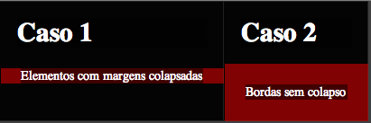

Visão geral sobre o tema de margens que entram em colapso em CSS ou [Collapsing Margins](http://www.w3.org/TR/CSS21/box.html#collapsing-margins) que é parte da especificação CSS.

## Introdução

A especificação CSS diz que existem casos onde as margens de elementos que estão *colados* devem entrar em colapso, ou seja, deverão se tornar uma única margem. O efeito as vezes é confuso porque não é o intuitivamente esperado por desenvolvedores. Vejamos o exemplo abaixo: 

    <h1>Título</h1>
    
Texto uga munga belonga.

Que tem as regras de estilo: 

    h1 { margin:20px } 
    p  { margin:25px } 

O efeito gerado visual será: 

    +-------------------------+
    | Título                  |
    +-------------------------+
       /\ 
       || 25 pixels 
       \/
    +-------------------------+
    | Texto uga munda belonga |
    +-------------------------+

Observe que a margem que prevalesce é a do maior elemento. 

## Caso de margens negativas, vale a somatória

    h1 { margin:20px } 
    p  { margin:-20px } 

O efeito gerado visual será: 

    +-------------------------+
    | Título                  |
    +-------------------------+
       /\ 
       || 0 pixels 
       \/
    +-------------------------+
    | Texto uga munda belonga |
    +-------------------------+

* Ainda vale lembrar que se ambas as margens forem negativas então não mais vale a somatória — daí o maior valor é utilizado. 

## Comparações 

Nos dois casos a estrutura do markup é a estrutura abaixo: 

    +-------------------+
    | h1 — Caso 1       | 
    +-------------------+ 
    +---------------------+  --> div pai do "p" com "texto interno.."
    |  +---------------+  | 
    |  | Texto interno |  | 
    |  +---------------+  | 
    +---------------------+ 
 
So que o DIV, no caso 2, tem uma regra de estilo com 'padding:1px', que faz com que o efeito seja desligado. Existem vários casos que disabilitam o colapso de margens. 

## Casos que margin collapsing é desligado

Como vimos, acima, um atributo padding, aplicado no pai do parágrafo, faz com que a 

## Nota do autor e observação sobre elementos transformados via CSS

Obrigado para Boris da Mozilla pela explicação (meu [bug](https://bugzilla.mozilla.org/show_bug.cgi?id=809208) ficou inválido) sobre o efeito que o Gecko faz em desligar o margin collapse para elementos transformados. 

## Referências

* [Margin Collapsing MDN](https://developer.mozilla.org/en-US/docs/CSS/margin_collapsing)
* [W3C Collapsing Margins](http://www.w3.org/TR/CSS21/box.html#collapsing-margins)

